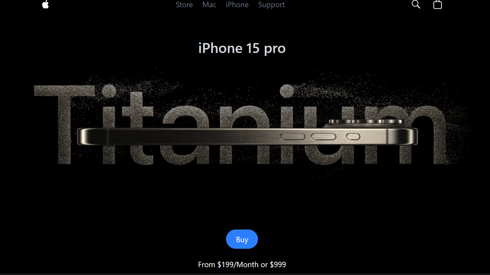
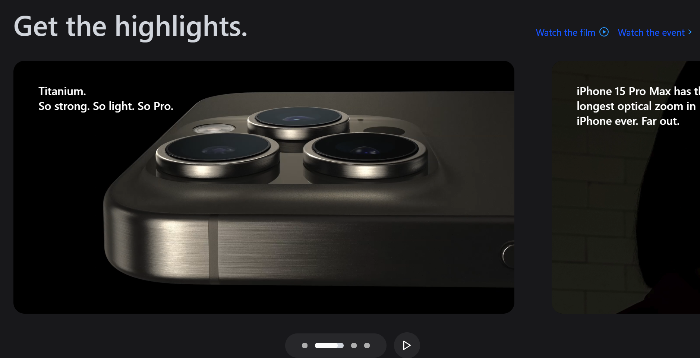
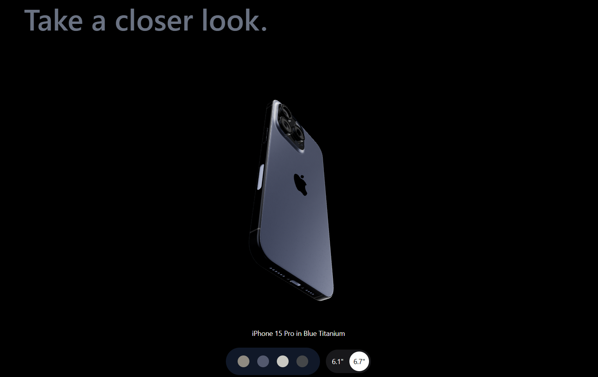
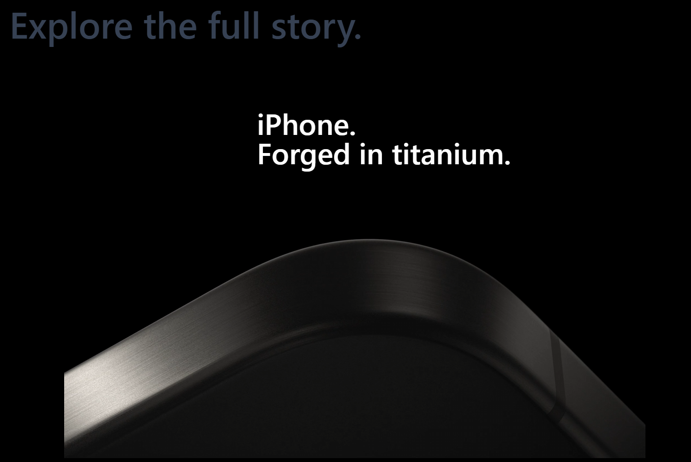

<h1 align="center">📱 iPhone 15 3D Website Clone</h1>

  An immersive and interactive 3D replica of the official iPhone 15 landing page built using <b>React</b>, <b>Three.js</b>, and <b>Vite</b>. Experience stunning visuals, smooth transitions, and a realistic product showcase.

---

<h2>🚀 Features</h2>

<ol>
  <li>📱 <strong>3D iPhone Model</strong>: Interactive .glb model powered by Three.js</li>
  <li>🧭 <strong>Single Page Application (SPA)</strong>: Seamless transitions without reloads</li>
  <li>🎨 <strong>Modern UI/UX</strong>: Clean animations and responsive design</li>
  <li>⚡ <strong>Optimized Performance</strong>: Built with Vite for ultra-fast development and production builds</li>
</ol>

---

<h2>🖼️ Screenshots</h2>

  <h2>Home</h2>
  
    
  <h2>Highlights</h2>
  
    
  <h2>3D Model</h2>
  
    
  <h2>Explore more</h2>
  
    
  

---

<h2>🛠️ Tech Stack</h2>

<ol>
  <li>👨‍💻 <strong>Frontend:</strong> React, HTML5, CSS3</li>
  <li>🎮 <strong>3D Rendering:</strong> Three.js (.glb format)</li>
  <li>⚙️ <strong>Build Tool:</strong> Vite</li>
  <li>🛡️ <strong>Error Monitoring:</strong> Sentry</li>
</ol>

---

<h2>📁 Project Structure</h2>

<pre>
3D-iphone-website/
├── public/
│   └── assets/
│       ├── images/
│       ├── videos/
│       └── models/           # 3D Model (scene.glb)
├── src/
│   ├── components/
│   │   ├── Chip.jsx
│   │   ├── Features.jsx
│   │   ├── Footer.jsx
│   │   ├── Hero.jsx
│   │   ├── Highlights.jsx
│   │   ├── IphoneModel.jsx
│   │   ├── Lights.jsx
│   │   ├── Loader.jsx
│   │   ├── Model.jsx
│   │   ├── ModelView.jsx
│   │   ├── Navbar.jsx
│   │   └── VideoSlideShow.jsx
│   ├── constants/
│   ├── utils/
│   ├── App.jsx
│   ├── main.jsx
│   └── index.css
├── vite.config.js
├── package.json
├── index.html
└── README.md
</pre>

---

<h2>📦 Getting Started</h2>

<h3>🔧 Prerequisites</h3>
<ul>
  <li>Node.js (v14 or later)</li>
  <li>npm or yarn</li>
</ul>

<h3>📥 Installation</h3>

<ol>
  <li>Clone the repository:
    <pre>git clone https://github.com/10Pratik01/3D-iphone-website.git
cd 3D-iphone-website</pre>
  </li>
  <li>Install dependencies:
    <pre>npm install</pre>
  </li>
  <li>Start development server:
    <pre>npm run dev</pre>
  </li>
</ol>

---

<h2>🧩 Sentry Integration (for Error Monitoring)</h2>

<ol>
  <li>Go to <a href="https://sentry.io">sentry.io</a> and sign up or log in</li>
  <li>Create a new project:
    <ul>
      <li>Select <strong>Browser</strong></li>
      <li>Select <strong>React</strong></li>
    </ul>
  </li>
  <li>Copy the Sentry setup snippet:</li>

<pre>
import * as Sentry from "@sentry/react";
import { BrowserTracing } from "@sentry/tracing";

Sentry.init({
  dsn: "https://your-dsn-key@o123456.ingest.sentry.io/project-id",
  integrations: [new BrowserTracing()],
  tracesSampleRate: 1.0,
});
</pre>

  <li>Paste the code at the top of <code>main.jsx</code></li>
  <li>Save and restart your development server</li>
</ol>

---

<h2>📜 Scripts</h2>

<ul>
  <li><code>npm run dev</code> – Launch development server</li>
  <li><code>npm run build</code> – Create production build</li>
  <li><code>npm run preview</code> – Preview production locally</li>
</ul>

---

<h2>📬 Feedback</h2>

If you like this project, consider giving it a ⭐ on GitHub. Contributions and suggestions are always welcome!

